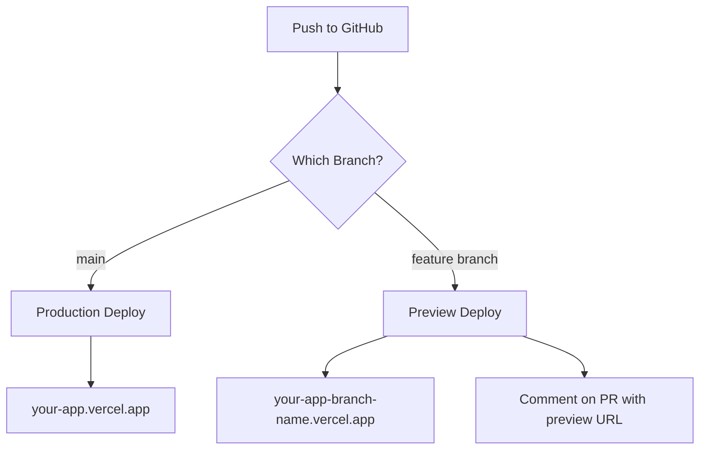

# Vercel Deployment Guide for Beginners

## 🚀 Deployment Types

### 1. **Production Deployment** (YC8N14kmd in your list)
- **What**: Your live, public-facing website
- **URL**: `your-project.vercel.app` (main domain)
- **Branch**: Usually `main` or `master`
- **When**: Automatically deploys when you push/merge to main
- **Use for**: Your stable, tested code that users will see

### 2. **Preview Deployments** (All others in your list)
- **What**: Temporary deployments for testing
- **URL**: `your-project-git-branch-name-username.vercel.app`
- **Branch**: Any branch except main
- **When**: Automatically created for:
  - Every push to a PR
  - Every push to any branch
- **Use for**: Testing changes before merging

## 📋 How Vercel Deployments Work



## 🔍 Understanding Your Deployment List

Looking at your deployments:
- **YC8N14kmd** (Production) - Your current live site from `main`
- **49LqZbB6j** (Ready) - Successfully deployed your fixes! ✅
- **3vJsEfXSM** (Ready) - Earlier successful deployment
- **CcvFYMKe5** (Error) - Failed due to aimakerspace issue
- **CzwJFR6UZ** (Building) - Currently deploying your latest push

## 🎯 Key Differences: Production vs Preview

| Feature | Production | Preview |
|---------|------------|----------|
| **URL** | Fixed (your-app.vercel.app) | Dynamic (includes branch name) |
| **Lifetime** | Permanent | Temporary (deleted after PR merge) |
| **Environment** | Production settings | Same as production (by default) |
| **Purpose** | Live users | Testing & review |
| **Indexing** | Google can index | Not indexed by search engines |
| **Analytics** | Tracked | Usually not tracked |

## 🛠️ Best Practices

### 1. **Always Check Preview URLs**
```bash
# After pushing to a branch
git push origin feature-branch

# Vercel bot will comment on your PR with:
# ✅ Preview: https://your-app-feature-branch-username.vercel.app
```

### 2. **Test on Preview Before Merging**
- Push to feature branch → Check preview URL
- Share preview URL with teammates for review
- Only merge to main after preview looks good

### 3. **Handle Environment Variables**
```bash
# Set different values for preview vs production
# In Vercel Dashboard > Settings > Environment Variables

# Example:
API_URL=https://api.yourapp.com  # Production only
API_URL=https://staging-api.yourapp.com  # Preview only
```

### 4. **Use Preview for Experiments**
```bash
# Create experimental branch
git checkout -b experiment/new-feature

# Push to get preview
git push origin experiment/new-feature

# Test at preview URL without affecting production
```

## 🚨 Common Issues & Solutions

### Issue 1: Build Cache Problems (Like we just experienced!)
**Solution**: Force rebuild
```bash
# In Vercel Dashboard
Settings → Functions → Purge Cache

# Or via Git (add dummy change)
echo "# Rebuild $(date)" >> README.md
git commit -am "Force rebuild"
git push
```

### Issue 2: Preview Not Updating
**Solution**: Check deployment status
- Green check ✅ = Deployed successfully
- Red X ❌ = Build failed (check logs)
- Yellow circle 🟡 = Building

### Issue 3: Different Behavior in Preview vs Local
**Solution**: Match Vercel environment
```bash
# Use same Node version as Vercel
node --version  # Check Vercel logs for their version

# Test build command locally
npm run build

# Use Vercel CLI
vercel dev  # Runs like Vercel preview
```

## 📊 Deployment Workflow

### Standard Workflow:
1. **Develop locally** → Test with `npm run dev`
2. **Push to feature branch** → Creates preview
3. **Test preview URL** → Share for feedback
4. **Merge to main** → Deploys to production
5. **Monitor production** → Check for issues

### Emergency Rollback:
```bash
# If production breaks after merge
# In Vercel Dashboard:
# 1. Go to deployments
# 2. Find last working production deploy
# 3. Click "..." → "Promote to Production"
```

## 🔧 Vercel CLI Commands

```bash
# Install Vercel CLI
npm install -g vercel

# Login to Vercel
vercel login

# Deploy manually to preview
vercel

# Deploy to production
vercel --prod

# Check deployment status
vercel ls

# View logs
vercel logs your-deployment-url

# Run locally like Vercel
vercel dev
```

## 💡 Pro Tips

1. **Preview URLs are shareable** - Send to clients/teammates for review
2. **Each commit gets new preview** - Old previews remain accessible
3. **Previews have same performance** - Test speed/optimization
4. **Use preview for A/B testing** - Deploy different versions to different branches
5. **Preview URLs persist** - Even after PR merge (for a while)

## 📈 Monitoring Deployments

In your Vercel dashboard:
- **Functions tab**: See API performance
- **Analytics tab**: Track visitor metrics (production only)
- **Logs tab**: Debug issues in real-time
- **Deployments tab**: Full deployment history

## 🎯 Your Current Situation

Looking at your deployments:
- ✅ **Production is stable** (YC8N14kmd)
- ✅ **Preview is now working** (49LqZbB6j - Ready!)
- ✅ **Your fixes worked** - The aimakerspace issue is resolved

Your preview URL should be something like:
`https://the-ai-engineer-challenge-s03-assignment-kaylahilt.vercel.app`

Check the PR comments for the exact URL! 